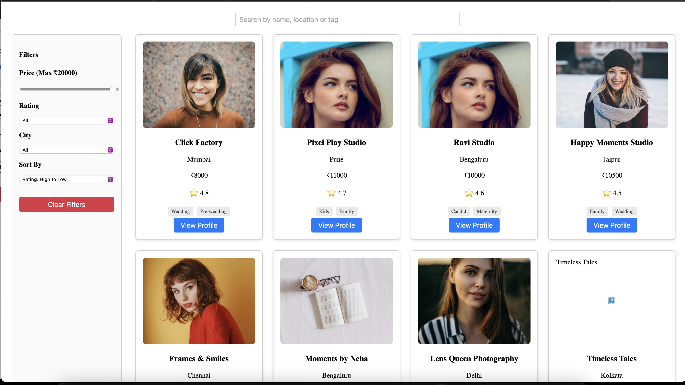
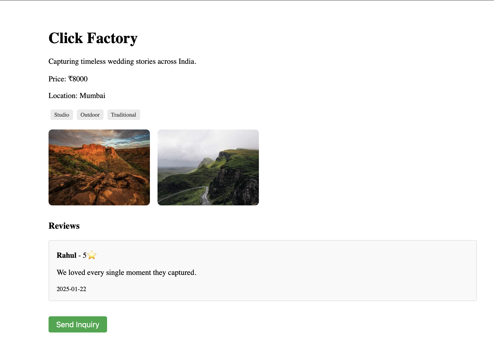
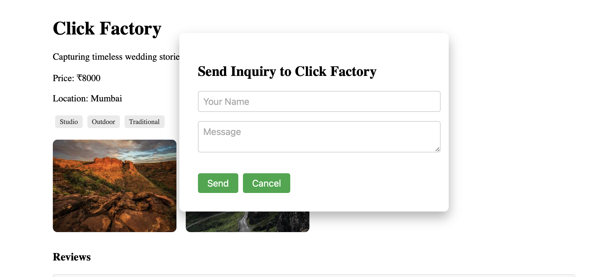

ImpresioStudio – Photographer Listing Platform
------------------------------------------------
A React-based web application to discover, filter, and book photographers based on location, style, price, and more. Built using Redux Toolkit for state management, and JSON server (or REST API) for data.

Setup Instructions
-------------------
1. Clone the Repository
git clone https://github.com/avinroy001/impresiostudio.git
cd impresiostudio
2. Install Dependencies
npm install
3. Start JSON Server (Local Backend)
Ensure db.json is present in the root.

npx json-server --watch db.json --port 3001
Or use a hosted mock API like Vercel's /api/photographers

4. Run the React App
npm start
The app will run at: https://impresiostudio.vercel.app

Features
----------
* View all photographers
* Filter by price, rating, city, styles
* Keyword search with debounce
* Sort by price or rating
* View detailed photographer profiles
* Portfolio and review sections
* Send inquiry via modal form
* Filtering & Logic

Filters
---------

Filters are stored in Redux and applied dynamically via the applyFilters() reducer. Filtering supports:

Price: Less than or equal to selected price
Rating: Greater than or equal to
City: Exact match
Styles: All selected styles must match
Search: Matches name, location, or tags
if (search)
  filtered = filtered.filter(
    (p) =>
      p.name.toLowerCase().includes(search.toLowerCase()) ||
      p.location.toLowerCase().includes(search.toLowerCase()) ||
      p.tags.some((t) =>
        t.toLowerCase().includes(search.toLowerCase())
      )
  );
Debounce
-----------

The SearchBar input uses setTimeout with clearTimeout to avoid triggering Redux filter logic on every keystroke, improving performance:

useEffect(() => {
  const delay = setTimeout(() => {
    dispatch(setFilters({ search: query }));
    dispatch(applyFilters());
  }, 300);

  return () => clearTimeout(delay);
}, [query]);

Screenshots
--------------
(Add your screenshots here if you have them)
Homepage with filter sidebar

Photographer profile with reviews and gallery

Inquiry Modal popup

Tech Stack
------------
React (CRA)
Redux Toolkit
React Router DOM
JSON Server for API simulation

Contact
---------
If you'd like to collaborate or have questions:
avin.roy001@gmail.com

